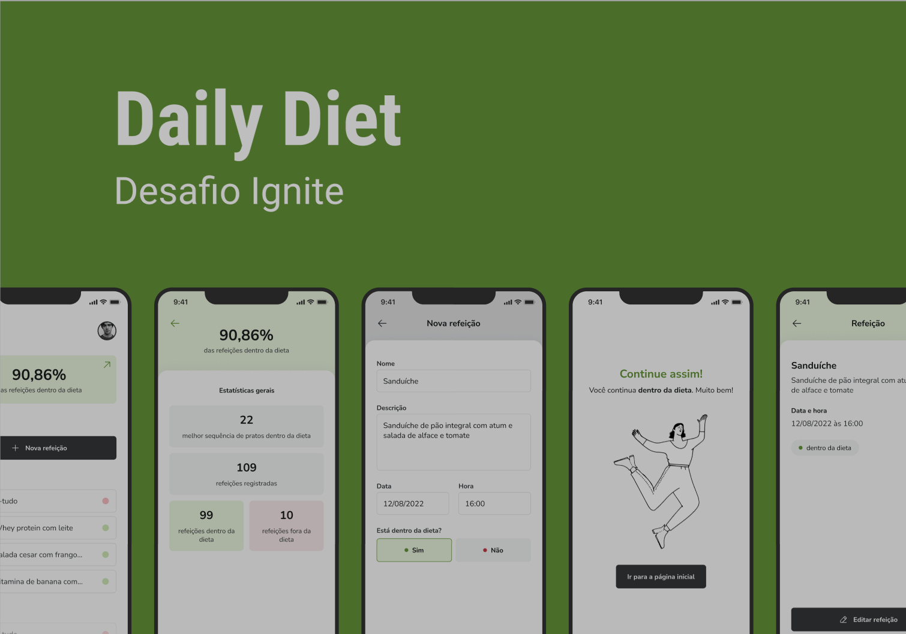

# API Daily Diet
*API para controle de dieta diária, a Daily Diet API.*

### Regras da aplicação

[ ] Deve ser possível criar um usuário
[ ] Deve ser possível identificar o usuário entre as requisições
[ ] Deve ser possível registrar uma refeição feita, com as seguintes informações:
    *As refeições devem ser relacionadas a um usuário.*
    - Nome
    - Descrição
    - Data e Hora
    - Está dentro ou não da dieta
[ ] Deve ser possível editar uma refeição, podendo alterar todos os dados acima
[ ] Deve ser possível apagar uma refeição
[ ] Deve ser possível listar todas as refeições de um usuário
[ ] Deve ser possível visualizar uma única refeição
[ ] Deve ser possível recuperar as métricas de um usuário
    [ ] Quantidade total de refeições registradas
    [ ] Quantidade total de refeições dentro da dieta
    [ ] Quantidade total de refeições fora da dieta
    [ ] Melhor sequência por dia de refeições dentro da dieta
[ ] O usuário só pode visualizar, editar e apagar as refeições o qual ele criou

### Contexto da aplicação

É comum ao estar desenvolvendo uma API, imaginar como esses dados vão estar sendo utilizados pelo cliente web e/ou mobile.

